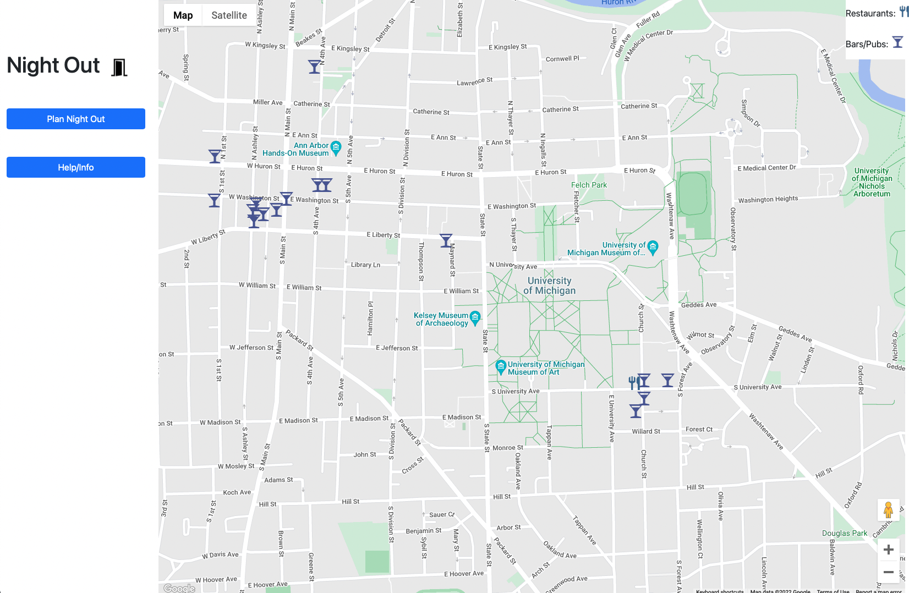

# Night Out

Editors: Alexander Greer, Max Housner, Shields Brian, Aleister Lenhardt
-final project for UMich's EECS 493 (User Interface Development).

Night Out is an application that generates bar crawl destitnations, currently set to three bars, that satisfies the preferences of all members in the group and minimizes the distances between locations. Hopefully this makes the planning component of going out for drinks stress free.
Test
This application uses the [Vue Framework](https://vuejs.org/) for JS. Map rendering was done using [Google Maps](https://www.google.com/maps) and data collection on establishments using the [Google Maps Api](https://developers.google.com/maps).

The application only operates on 27 bars and restaurants in Ann Arbor to ensure we could collect good data. In the future we may ask users to provide data and develop our own data set for price, quality, and type of drink for a wider range of establishments in Ann Arbor. 

## Demonstration of App

Upon opening the app you are greeted by the screen below. The navigation panel on the left has two interactable buttons: "Plan Night Out" and "Help/Info". The first navigates you to the functionality of the site while the second is a help screen explaining the details of the site.

When a user clicks the "Plan Night Out" button they are shown this profile dialogue box.

They can click on a price range from one to three money signs (same convention as google maps), a type of alcohol, fill in the name field, and finally save the profile by clicking the *Create Profile* button. 

The process continues for every person you would like to add to the bar crawl. You can delete members using the *Delete All Profiles* or the *Delete Profile* buttons seen below. 

When the user is satisfied with their selections they can hit the plan night out button. This shows the three restaurants which fufill the needs of the group as best as possible. In the dialogue boxes that appear over these establishtments you can find information about hours, address, current status, and contact information.

Note: The Google Maps Api Key used during the development of this project is deleted. If you would like to use this application you can contact me at amgreer@umich.edu

That's all there is to it. - Cheers 

